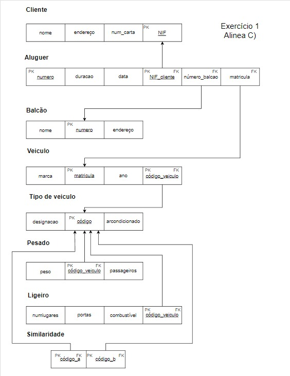
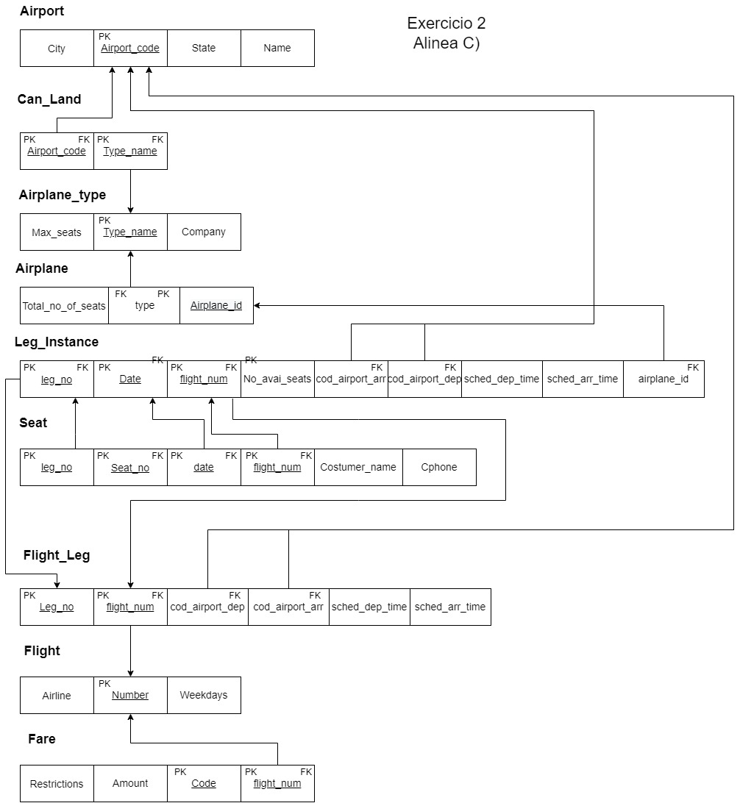
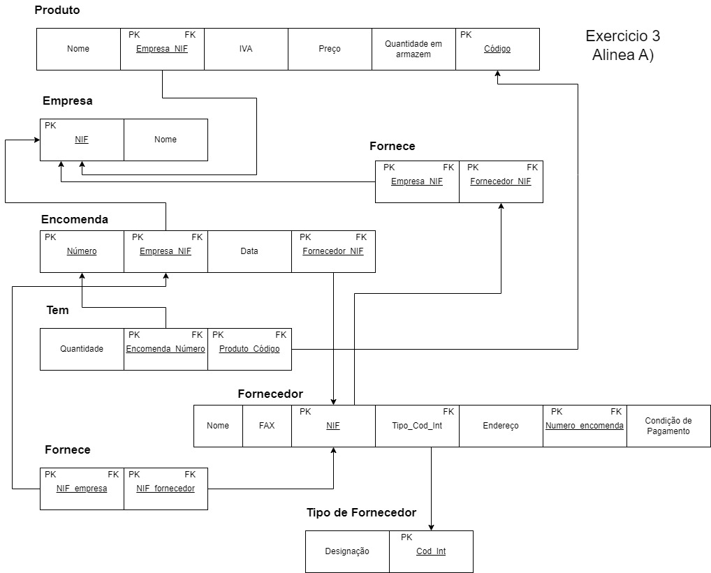
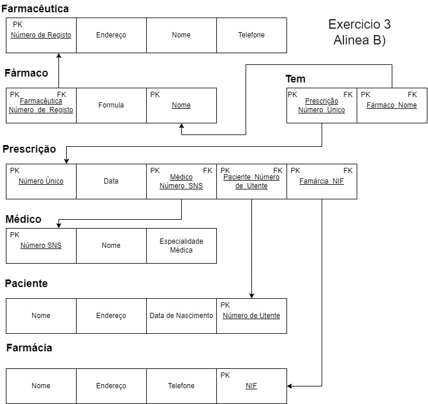
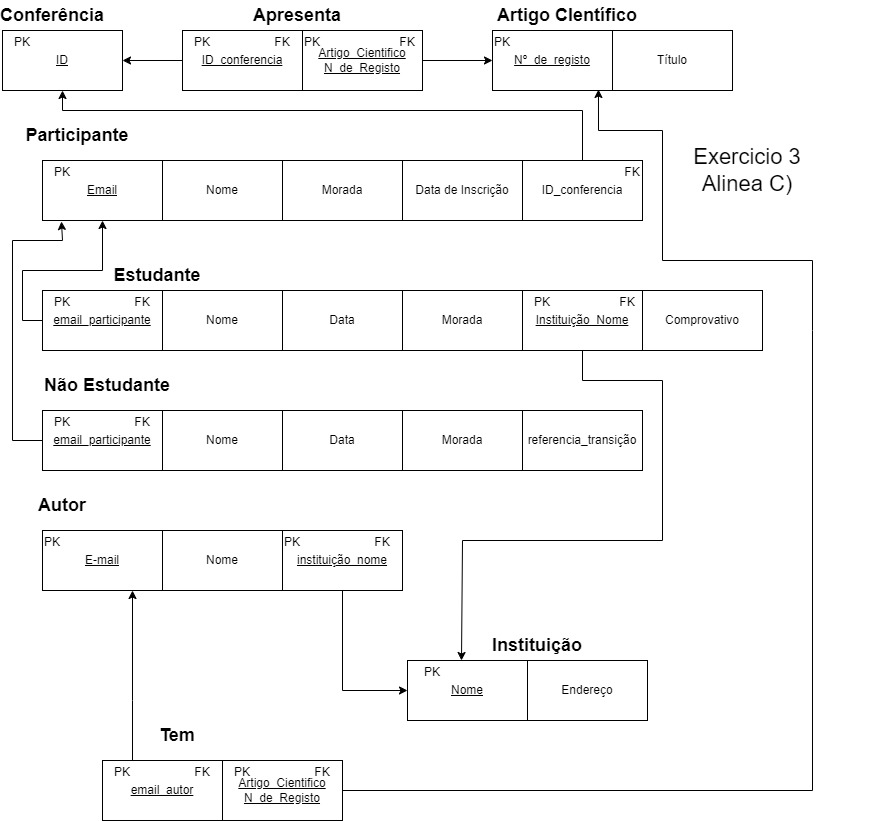
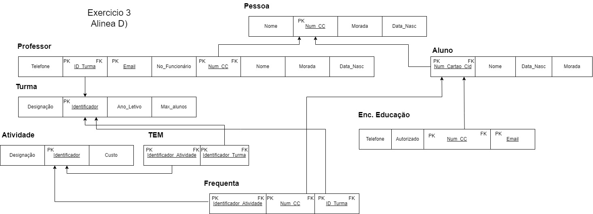

# BD: Guião 3


## ​Problema 3.1
 
### *a)*

```
CLIENTE

nome | endereço | num_carta | NIF

ALUGUER

número | duração | data

BALCAO 

nome | número | endereço | data | nif_cliente | matricula | num_balcao

VEICULO

matricula | ano | marca

TIPO VEICULO

designação | arcondicionado | código

SIMILARIDADE

codigo_a | codigo_b

PESADO 

peso | passageiros | codigo

LIGEIROS

numlugares | portas | combustivel | codigo
```


### *b)* 

```
Chaves, colocadas todas na alinea c)
```


### *c)* 




## ​Problema 3.2

### *a)*

```
Relações, colocadas todas na alinea c)
```


### *b)* 

```
Chaves, colocadas todas na alinea c)
```


### *c)* 




## ​Problema 3.3


### *a)* 2.1



### *b)* 2.2



### *c)* 2.3



### *d)* 2.4

